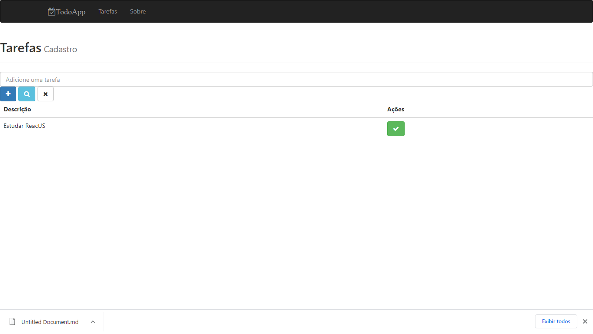

# Portfólio

Bem vindos ao meu portfólio, abaixo estão listados os links de repositórios e deploy de projetos feitos para estudo de linguagens e tecnologias para desenvolvimento de software.
Os projetos estão ordenados do mais atual ao mais antigo.

  

# NLW2 - Proffy 

Projeto desenvolvido na Next Level Week da Rocketseat

<h1 align="center">
    
</h1>

#### Deploy
[Proffy WebSite](https://nlw2-proffy-isnack.netlify.app)

#### Repositórios
##### Front-end: [Proffy App (React)](https://github.com/isnack/nlw2)
#### Back-end: [Proffy Api Server (NodeJS/POSTGRES)](https://github.com/isnack/proffy-backend)

   

# Todo App

Projeto desenvolvido no Curso React + Redux: Fundamentos e 2 Apps do Absoluto ZERO! da udemy

<h1 align="center">
    
</h1>

#### Deploy
[Todo App WebSite](https://isntodoapp.netlify.app/)

#### Repositórios

##### Front-end: [Todo App (React)](https://github.com/isnack/todo-app-react-frontend)
#### Back-end: [Todo Api Server (NodeJS/MongoDB)](https://github.com/isnack/todo-app-react-backend)

   

# Teste Chaordic

Esse é um teste que eu encontrei no github e consistia em desenvolver uma página para encurtar links usando somente Javascript e html/css

<h1 align="center">
    
</h1>

#### Deploy
[Chaordic Test](https://frontend-intern-challenge-chaordic.netlify.app/)

#### Repositório
##### Front-end: [Chaordic (Javascript)](https://github.com/isnack/frontend-intern-challenge)

   

# Projetos Freecodecamp

Projetos realizados para o certificado o curso  Responsive Web Design 

#### Deploy
[Tribute Page](https://freecodecamp-tributepage-isnack.netlify.app/)

#### Repositório
##### Front-end: [Tribute Page (Html/css)](https://github.com/isnack/freecodecamp-tributepage)

   

# Trabalho conclusão de curso (Uso de testes automatizados no desenvolvimento de software)

O trabalho aborda teste unitário,integração teste funcional usando o AngularJS front-end, NodeJS no back-end juntamente com Restify para fazer uma Web Api e MongoDB para Armazenamento.
Na bateria de testes funcionais foi utilizado o CasperJS e Mocha/Chai para os testes unitários e de integração.
TravisCI para a integração contínua e coveralls para mostrar a cobertura dos testes.

#### Repositório
##### Projeto: [O Uso de testes automatizados no desenvolvimento de software](https://github.com/isnack/freecodecamp-tributepage)
